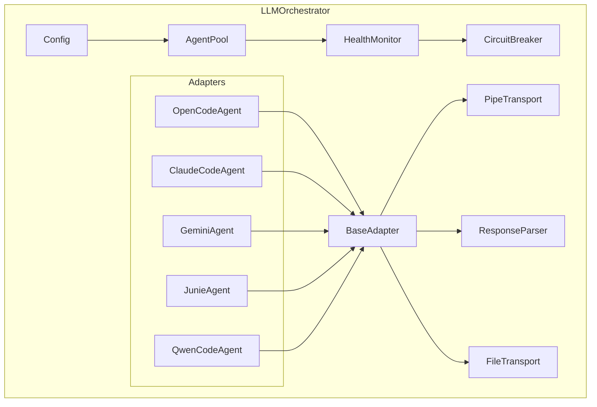
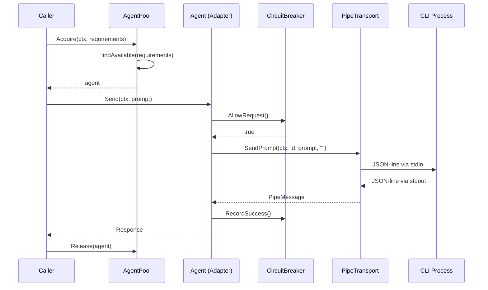
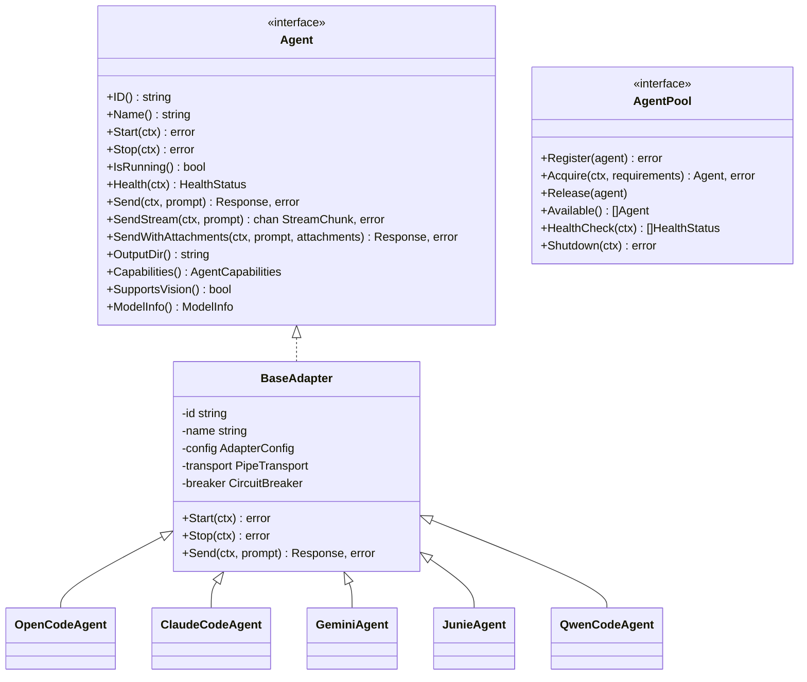
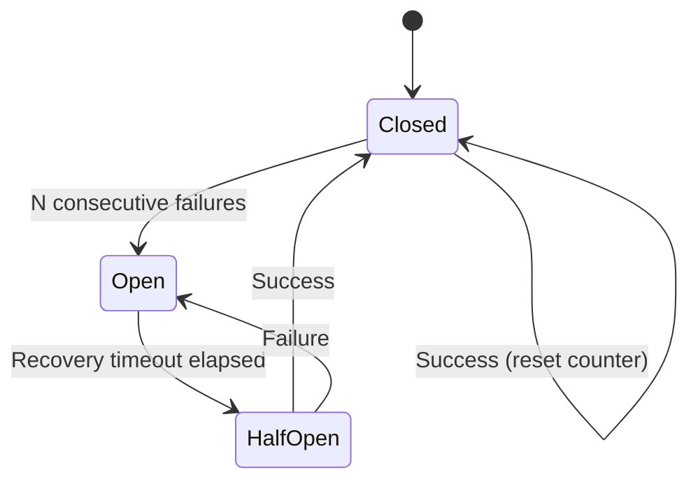
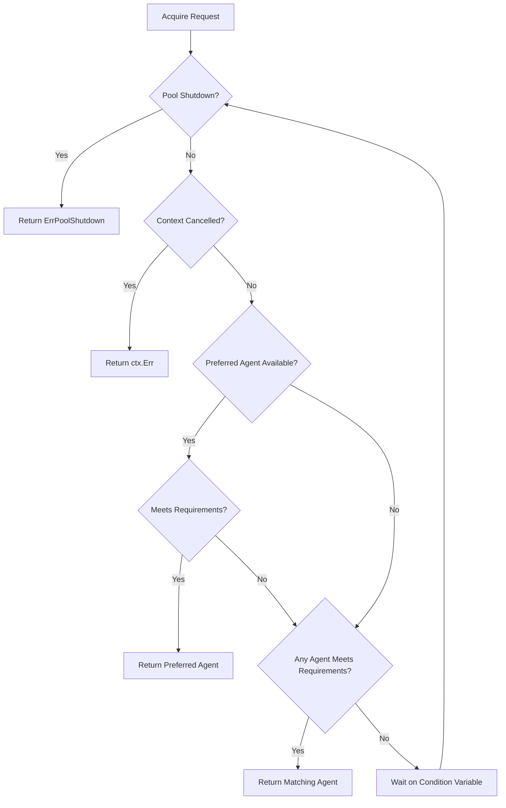

# Architecture

## Component Diagram

## Sequence Diagram: Agent Send

## Class Diagram

## State Diagram: Circuit Breaker

## Flowchart: Agent Acquisition

## Key Design Decisions

1. **BaseAdapter Pattern**: Shared process management (spawn, pipe, shutdown) in BaseAdapter. Each CLI adapter only implements protocol-specific response parsing.

2. **Thread-safe Pool**: Uses `sync.Mutex` + `sync.Cond` for blocking acquire with context cancellation support.

3. **Circuit Breaker**: Per-agent, 3 consecutive failures opens the circuit for 60 seconds. Half-open state allows probe requests.

4. **Hybrid Communication**: Real-time pipe for interactive prompts, file-based for large artifacts. Prevents blocking on large payloads.

5. **No Module Dependencies**: LLMOrchestrator defines its own types (ModelInfo, etc.) and does not import LLMsVerifier, VisionEngine, or DocProcessor. HelixQA bridges them.
