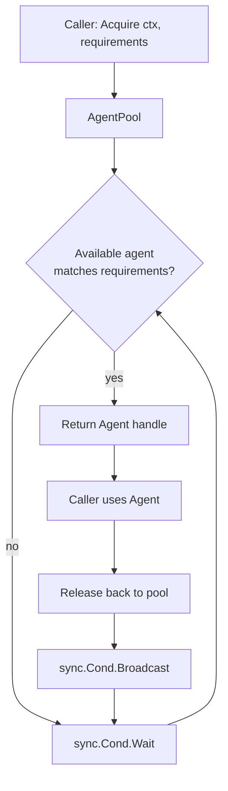
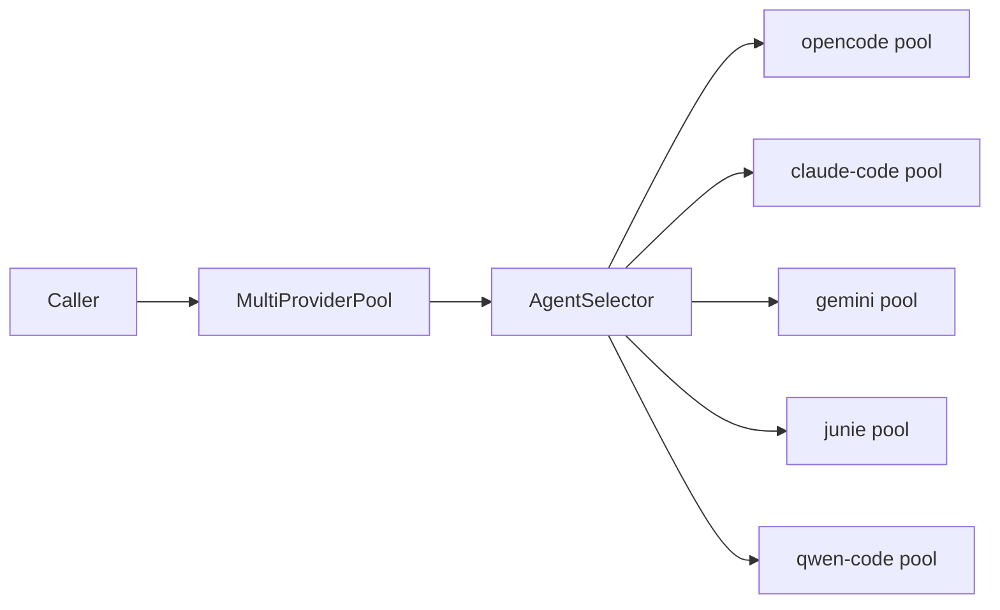

# LLMOrchestrator Architecture

**Module:** `digital.vasic.llmorchestrator`

LLMOrchestrator manages headless CLI agents (OpenCode, Claude Code, Gemini, Junie,
Qwen Code) with a hybrid pipe+file communication protocol. It provides a unified
`Agent` interface, a thread-safe `AgentPool`, per-agent circuit breakers, a
`MultiProviderPool` with pluggable `AgentSelector` strategies, and a structured
`ResponseParser`.

---

## Package Overview

| Package | Role |
|---------|------|
| `pkg/agent` | `Agent`/`AgentPool`/`AgentSelector` interfaces; `MultiProviderPool`, `RoundRobinSelector`, `PreferenceSelector`, `CircuitBreaker`, `HealthMonitor` |
| `pkg/adapter` | `BaseAdapter` + 5 CLI agents (`ClaudeCodeAgent`, `GeminiAgent`, `JunieAgent`, `OpenCodeAgent`, `QwenCodeAgent`); `OpenCodeAdapter` drives OpenCode with a headless mode via `OpenCodeConfig.Headless` |
| `pkg/protocol` | `PipeTransport` (JSON-lines) and `FileTransport` (inbox/outbox/shared) |
| `pkg/parser` | `ResponseParser`: action, issue, and JSON extraction |
| `pkg/config` | `.env` loading, binary path resolution, validation |
| `pkg/i18n` | `Translator` contract for CLI message localization |

---

## Agent Pool



`AgentPool` is protected by `sync.Mutex` + `sync.Cond`. `Acquire` blocks until a
matching agent is available or `ctx` is cancelled, preventing busy-wait. Capability
matching checks agent type, health status, and workload flags declared in
`requirements`.

---

## Multi-Provider Pool

`MultiProviderPool` (in `pkg/agent`) manages agents from multiple CLI providers
under a single `AgentPool`-compatible facade. Selection strategy is provided by an
`AgentSelector`:

- **`RoundRobinSelector`** — cycles through available providers in round-robin order,
  skipping providers whose agents do not satisfy the caller's `AgentRequirements`.
- **`PreferenceSelector`** — walks a priority-ordered list of provider names and
  returns the first one that has an agent meeting requirements; falls back to any
  available provider.



---

## Adapter Pattern

```
Agent interface
  └─ BaseAdapter (pkg/adapter — shared process management)
       ├─ ClaudeCodeAgent        (parses claude-code streaming JSON)
       ├─ GeminiAgent            (parses gemini JSON output)
       ├─ JunieAgent             (parses junie output format)
       ├─ OpenCodeAgent          (parses opencode JSON-lines output)
       ├─ OpenCodeAdapter        (OpenCode process driver; headless via OpenCodeConfig.Headless)
       └─ QwenCodeAgent          (parses qwen-code output format)
```

`BaseAdapter` owns process lifecycle: `Start` (exec + pipe setup), `Stop` (SIGTERM
with timeout, SIGKILL fallback), `Restart`, and `IsAlive`. Each concrete adapter
only implements `ParseResponse(raw string) (*Response, error)` and declares its
binary name and default flags, keeping per-agent code minimal.

`OpenCodeAdapter` (`pkg/adapter/opencode_headless.go`) drives the OpenCode CLI
process. It runs in headless, non-interactive mode when `OpenCodeConfig.Headless`
is set, isolating the headless flag and config differences in one place.

---

## Hybrid Communication Protocol

### Pipe Transport (real-time)

`protocol.PipeTransport` attaches to the agent's stdin/stdout as a JSON-lines stream:

```
stdin  →  {"type":"prompt","content":"...","id":"req-1"}\n
stdout ←  {"type":"response","content":"...","id":"req-1"}\n
```

Each message is a single newline-terminated JSON object. The transport enforces a
configurable response length limit and a read deadline per request.

### File Transport (artifact exchange)

`protocol.FileTransport` manages three directories per agent session:

| Directory | Purpose |
|-----------|---------|
| `inbox/` | Files written by the caller for the agent to read |
| `outbox/` | Files written by the agent for the caller to consume |
| `shared/` | Bidirectional scratch space for large artifacts |

File transport is used for code files, diffs, and other payloads too large or
ill-suited for inline JSON.

---

## Circuit Breaker

Each agent has an independent `CircuitBreaker`:

- **Closed** (healthy) — requests pass through normally.
- **Open** (unhealthy) — after 3 consecutive failures, requests are rejected
  immediately for a 60-second cool-down period.
- **Half-Open** — after the cool-down, one probe request is allowed; success
  returns to Closed, failure resets the 60-second timer.

`HealthMonitor` runs a background goroutine that periodically calls `Agent.Ping`
and feeds results into the circuit breaker, allowing recovery without requiring
an incoming request.

---

## Response Parser

`parser.ResponseParser` operates on raw string output and extracts:

| Extraction | Pattern |
|------------|---------|
| JSON blocks | First valid JSON object or array in the output |
| Actions | Lines matching `ACTION: <verb> <target>` convention |
| Issues | Lines matching `ISSUE:` or `ERROR:` prefixes |

The parser is intentionally stateless and side-effect-free, making it safe to call
concurrently from multiple goroutines without locking.

---

## Security Constraints

- **Path traversal protection** — `FileTransport` rejects any path containing `..`
  or absolute segments outside the session directory.
- **Response length limit** — `PipeTransport` returns an error if a single response
  exceeds the configured byte ceiling (default 1 MB).
- **API key masking** — Config loader redacts `*_API_KEY` values in log output.
- **Command injection prevention** — Agent binary paths are validated against an
  allowlist; no shell interpolation is used when spawning processes.
